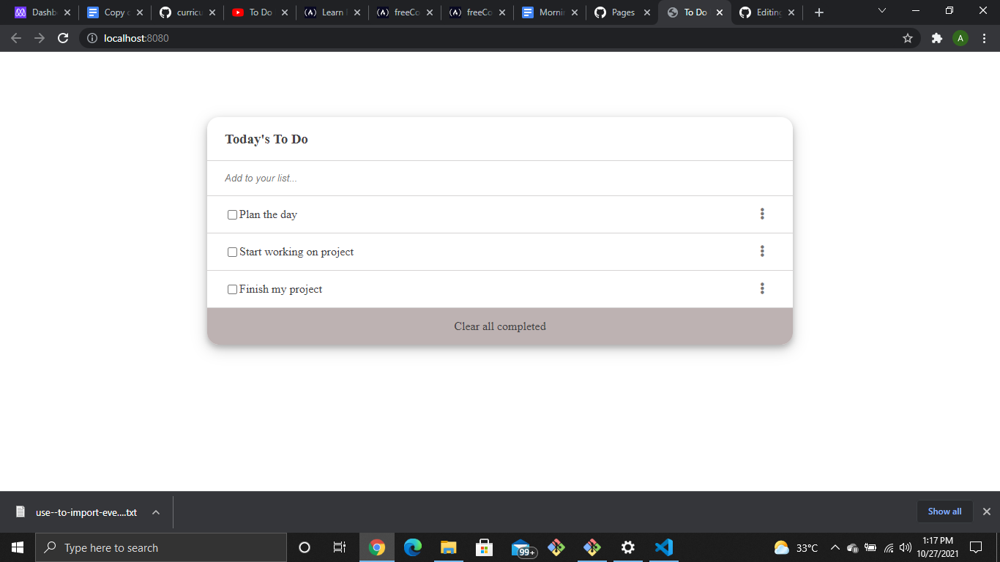

# To Do List

> Creating an App for daily todo list.

.

## Built With

- HTML
- CSS
- JavaScript
- Webpack

## Application Page url

https://phelian23.github.io/to-do-list/

## Getting Started

> To get a local copy follow the following steps:

- Copy this link https://github.com/phelian23/to-do-list.git
- Open your terminal or command line
- Run git clone and paste the link
- Open the folder with your code editor
- Create a branch to work on

## Authors

👤 **Phelian23**

- GitHub: [@phelian23](https://github.com/phelian23)

## 🤝 Contributing

Contributions, issues, and feature requests are welcome!

Feel free to check the [issues page](../../issues/).

## Show your support

Give a ⭐️ if you like this project!

## Acknowledgments

- Hat tip to anyone whose code was used
- Inspiration
- etc

## 📝 License

This project is [MIT](./MIT.md) licensed.
